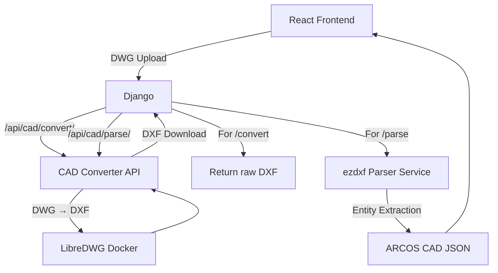

# ARCOS CAD Processing System — Phase 4
**DXF → ARCOS CAD JSON**

## Overview
Phase 4 introduces an entity extraction layer into the Django backend using `ezdxf`. This phase sits strictly behind the backend boundary. It receives raw DWG files, proxies them through our existing Dockerized LibreDWG service to get DXF format, and then parses that DXF data into a custom, normalized `ARCOS CAD JSON` format designed for web-based rendering.

No WebGL or viewer UI was implemented in this phase, honoring the architectural boundary constraints.

## Architecture
The system architecture has been extended to support the new JSON pipeline while maintaining full backwards compatibility with the existing DXF proxy.



## `ezdxf` Role
We selected the MIT-licensed `ezdxf` package as our Python parsing layer.
- **Dependency:** Installed via pip (`ezdxf==1.2.0`) into the Django `.venv`.
- **Purpose:** Decodes the DXF binary/text structures. Extracts Layer definitions, Block references, Bounding box extents, and spatial geometric primitives (Lines, Arcs, etc).
- **Execution:** Operates on temporary secure files isolated from HTTP request lifecycles.

## Parser Architecture
The parsing logic is cleanly separated into a `cad` module in Django:

1. **`backend/cad/parsers/dxf_parser.py`**: Contains the `ArcosDxfParser` class. It loads the `ezdxf` document, queries the bounds, iterates through Modelspace, and applies specific geometry formatting strategies depending on the `dxftype()`. It collects internal statistics and logs parsing exceptions internally.
2. **`backend/cad/services/cad_processing.py`**: Acts as the orchestrator. It manages temp file I/O, invokes the proxy to the `FastAPI` service, passes the result to the parser, and yields the final JSON payload safely.

## ARCOS CAD JSON Schema
The output format is independent of `ezdxf` internals and optimized for rapid consumption by a future WebGL renderer. 

```json
{
  "success": true,
  "data": {
    "version": "1.0",
    "document": {
      "name": "F2841747.dwg",
      "format": "DXF"
    },
    "units": { "name": null, "code": null },
    "bounds": {
      "min": [0.0, 0.0, 0.0],
      "max": [100.0, 100.0, 0.0]
    },
    "layers": [
      {
        "name": "0",
        "color": 7,
        "linetype": "Continuous",
        "visible": true,
        "frozen": false,
        "locked": false
      }
    ],
    "blocks": [
      {
        "name": "DOOR",
        "basePoint": [0.0, 0.0, 0.0]
      }
    ],
    "layouts": [],
    "entities": [
      {
        "id": "A23",
        "type": "LINE",
        "layer": "0",
        "style": { "color": 7, "linetype": null, "lineweight": null },
        "geometry": { "start": [0,0,0], "end": [10,10,0] }
      }
    ],
    "statistics": {
      "totalEntities": 1500,
      "supportedEntities": 1450,
      "unsupportedEntities": 50,
      "layers": 12,
      "blocks": 4,
      "parsingTimeMs": 350,
      "entityTypes": {
        "LINE": 1000,
        "CIRCLE": 450
      }
    },
    "warnings": []
  }
}
```

### Supported Entities
The MVP parser extracts the following geometries:
- `LINE`
- `CIRCLE`
- `ARC`
- `LWPOLYLINE` / `POLYLINE`
- `ELLIPSE`
- `SPLINE`
- `POINT`
- `TEXT` / `MTEXT`
- `HATCH`
- `INSERT` (Block references)

### Unsupported Entity Handling
If an entity is completely unsupported, or if it triggers an unexpected extraction exception, the parser intercepts the failure. The entire parsing process *does not crash*. Instead:
1. The `unsupportedEntities` statistic is incremented.
2. A JSON warning is appended to the `"warnings": []` array containing the exact `entityType` and failure message.

## API Endpoints
The backend now supports two CAD endpoints:
1. `POST /api/cad/convert/`: (Phase 3 Legacy) Returns the raw `attachment` DXF file.
2. `POST /api/cad/parse/`: (Phase 4 New) Returns `application/json` structured data.

## Error Handling
The orchestration service correctly relays network failures, corrupt DXF structure errors, and HTTP `503` statuses back to the client as clean JSON responses without exposing raw stack traces.

## Testing & Performance
Real DWG file testing was conducted locally.
- **Conversion Phase:** LibreDWG translates the DWG to a 23MB DXF seamlessly.
- **Parsing Phase:** `ezdxf` parses the dense 23MB DXF into memory and completes the tree-walk entity extraction.
- **File Management:** Temporary `.dxf` payloads are purged unconditionally inside a Python `finally:` block.
